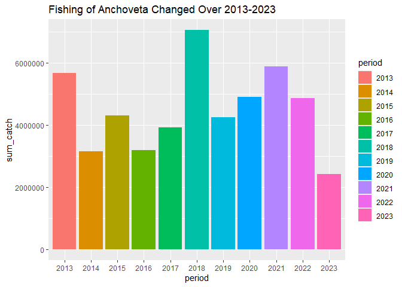
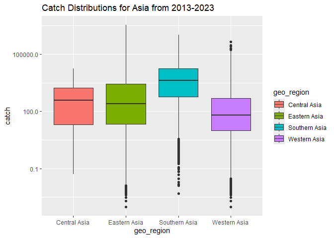

## Instructions
Answer the following questions and/or complete the exercises in RMarkdown. Please embed all of your code and push the final work to your repository. Your report should be organized, clean, and run free from errors. Remember, you must remove the `#` for any included code chunks to run.  

## Load the libraries

``` r
library("tidyverse")
library("janitor")
#library("naniar")
options(scipen = 999)
```

## About the Data
For this assignment we are going to work with a data set from the [United Nations Food and Agriculture Organization](https://www.fao.org/fishery/en/collection/capture) on world fisheries. These data were downloaded and cleaned using the `fisheries_clean.Rmd` script.  

Load the data `fisheries_clean.csv` as a new object titled `fisheries_clean`.

``` r
fisheries_clean <- read_csv("data/fisheries_clean.csv")
```

1. Explore the data. What are the names of the variables, what are the dimensions, are there any NA's, what are the classes of the variables, etc.? You may use the functions that you prefer.
There is no NA.

``` r
glimpse(fisheries_clean)
```

```
## Rows: 1,055,015
## Columns: 9
## $ period          <dbl> 1950, 1951, 1952, 1953, 1954, 1955, 1956, 1957, 1958, …
## $ continent       <chr> "Asia", "Asia", "Asia", "Asia", "Asia", "Asia", "Asia"…
## $ geo_region      <chr> "Southern Asia", "Southern Asia", "Southern Asia", "So…
## $ country         <chr> "Afghanistan", "Afghanistan", "Afghanistan", "Afghanis…
## $ scientific_name <chr> "Osteichthyes", "Osteichthyes", "Osteichthyes", "Ostei…
## $ common_name     <chr> "Freshwater fishes NEI", "Freshwater fishes NEI", "Fre…
## $ taxonomic_code  <chr> "1990XXXXXXXX106", "1990XXXXXXXX106", "1990XXXXXXXX106…
## $ catch           <dbl> 100, 100, 100, 100, 100, 200, 200, 200, 200, 200, 200,…
## $ status          <chr> "A", "A", "A", "A", "A", "A", "A", "A", "A", "A", "A",…
```

2. Convert the following variables to factors: `period`, `continent`, `geo_region`, `country`, `scientific_name`, `common_name`, `taxonomic_code`, and `status`.

``` r
fisheries_clean <- fisheries_clean %>%
  mutate(across(c(period, continent, geo_region, country, scientific_name, common_name, taxonomic_code, status), as.factor))
```

##(skip this question)
3. Are there any missing values in the data? If so, which variables contain missing values and how many are missing for each variable?


4. How many countries are represented in the data?
249 countries

``` r
fisheries_clean %>%
  distinct(country)
```

```
## # A tibble: 249 × 1
##    country            
##    <fct>              
##  1 Afghanistan        
##  2 Albania            
##  3 Algeria            
##  4 American Samoa     
##  5 Andorra            
##  6 Angola             
##  7 Anguilla           
##  8 Antigua and Barbuda
##  9 Argentina          
## 10 Armenia            
## # ℹ 239 more rows
```

5. The variables `common_name` and `taxonomic_code` both refer to species. How many unique species are represented in the data based on each of these variables? Are the numbers the same or different?
3722 species

``` r
fisheries_clean %>%
  select(common_name, taxonomic_code)%>%
  n_distinct()
```

```
## [1] 3722
```

6. In 2023, what were the top five countries that had the highest overall catch?

``` r
fisheries_clean %>%
  select(period, catch, country) %>%
  filter(period=="2023") %>%
  group_by(country) %>%
  summarize(sum_catch=sum(catch))%>%
  arrange(desc(sum_catch))
```

```
## # A tibble: 238 × 2
##    country                  sum_catch
##    <fct>                        <dbl>
##  1 China                    13424705.
##  2 Indonesia                 7820833.
##  3 India                     6177985.
##  4 Russian Federation        5398032 
##  5 United States of America  4623694 
##  6 Peru                      3519381.
##  7 Viet Nam                  3417238.
##  8 Japan                     2904942.
##  9 Chile                     2596488.
## 10 Norway                    2546846.
## # ℹ 228 more rows
```

7. In 2023, what were the top 10 most caught species? To keep things simple, assume `common_name` is sufficient to identify species. What does `NEI` stand for in some of the common names? How might this be concerning from a fisheries management perspective?

NEI stands for not elsewhere included, meaning that multiple species are grouped together rather than reported individually. This could be concerning because this leads to deviation of data, which the reported data might be lower than actual. In fisheries management perspective, this could leads to overfishing of individual species and making inaccurate decesion on preparing its stock. 

``` r
fisheries_clean %>%
  select(period, catch, common_name) %>%
  filter(period=="2023") %>%
  group_by(common_name) %>%
  summarize(sum_catch=sum(catch))%>%
  arrange(desc(sum_catch))
```

```
## # A tibble: 2,870 × 2
##    common_name                    sum_catch
##    <fct>                              <dbl>
##  1 Marine fishes NEI               8553907.
##  2 Freshwater fishes NEI           5880104.
##  3 Alaska pollock(=Walleye poll.)  3543411.
##  4 Skipjack tuna                   2954736.
##  5 Anchoveta(=Peruvian anchovy)    2415709.
##  6 Blue whiting(=Poutassou)        1739484.
##  7 Pacific sardine                 1678237.
##  8 Yellowfin tuna                  1601369.
##  9 Atlantic herring                1432807.
## 10 Scads NEI                       1344190.
## # ℹ 2,860 more rows
```

8. For the species that was caught the most above (not NEI), which country had the highest catch in 2023?
Peru have the highest catch.

``` r
fisheries_clean %>%
  select(period, catch, country, common_name) %>%
  filter(period=="2023") %>%
  group_by(country, common_name) %>%
  summarize(sum_catch=sum(catch))%>%
  arrange(desc(sum_catch))
```

```
## `summarise()` has grouped output by 'country'. You can override using the
## `.groups` argument.
```

```
## # A tibble: 13,862 × 3
## # Groups:   country [238]
##    country                  common_name                    sum_catch
##    <fct>                    <fct>                              <dbl>
##  1 China                    Marine fishes NEI               2661523.
##  2 Viet Nam                 Marine fishes NEI               2190211.
##  3 Peru                     Anchoveta(=Peruvian anchovy)    2047732.
##  4 Russian Federation       Alaska pollock(=Walleye poll.)  1893924 
##  5 United States of America Alaska pollock(=Walleye poll.)  1433538 
##  6 Bangladesh               Freshwater fishes NEI           1040470 
##  7 China                    Largehead hairtail               910275 
##  8 China                    Freshwater fishes NEI            908467 
##  9 Myanmar                  Freshwater fishes NEI            902360 
## 10 Chile                    Chilean jack mackerel            852831 
## # ℹ 13,852 more rows
```

9. How has fishing of this species changed over the last decade (2013-2023)? Create a plot showing total catch by year for this species.

``` r
fisheries_clean %>%
  select(period, catch, country, common_name)%>%
  filter((period %in% 2013:2023), 
           common_name=="Anchoveta(=Peruvian anchovy)") %>%
  group_by(period) %>%
  summarize(sum_catch=sum(catch))%>%
  ggplot(aes(x=period, y=sum_catch))+
  geom_col(mapping=aes(fill=period))+
  labs(title="Fishing of Anchoveta Changed Over 2013-2023" )
```

<!-- -->

10. Perform one exploratory analysis of your choice.Make sure to clearly state the question you are asking before writing any code.
How does catch vary across Asian regions from 2013–2023?

``` r
fisheries_clean %>%
  filter((period %in% 2013:2023), geo_region%in% c("Central Asia", "Southern Asia", "Eastern Asia", "Western Asia"), catch>0)%>%
  ggplot(aes(x=geo_region, y=catch))+
  geom_boxplot(mapping=aes(fill=geo_region))+
  labs(title="Catch Distributions for Asia from 2013-2023")+
  scale_y_log10()
```

<!-- -->

## Knit and Upload
Please knit your work as an .html file and upload to Canvas. Homework is due before the start of the next lab. No late work is accepted. Make sure to use the formatting conventions of RMarkdown to make your report neat and clean!  
